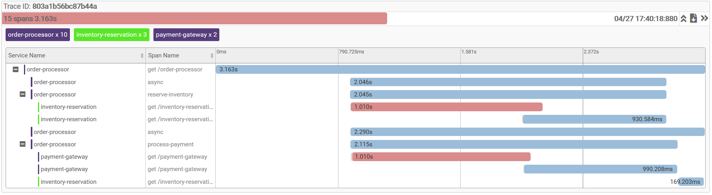

Distributed tracing showcase using [Spring Cloud Sleuth](https://spring.io/projects/spring-cloud-sleuth) and [Zipkin](https://zipkin.io/).

### Application

The demo apps simulate e-commerce order processing with 4 microservices: `order-processor`, `inventory-reservation`, `payment-gateway` and `shipment`. The following mermaid sequence diagram (available on [docs/call-sequence.md](docs/call-sequence.md)) illustrates the workflow:


Some calls are asynchronous (using Spring's `@Async`) and the applications are rigged to sometimes trigger client timeouts. That behavior, plus the retries clients make, can all be infered just by looking at the traces. For instance:



First we can notice payment failed since there's no span for the `shipment` service and there's a second call to `inventory-reservation` in order to cancel the reservation. 

The two `async` spans show us that inventory reservation and payment processing were done paralelly. We can also see that once both are done the remaining work will reuse threads (the reservation was cancelled under the same parent span and with no further `async` spans opened).

There's also an overlap between the timed out inventory-reservation call and its retry. The same overlap happens on payment-gateway. This shows the importance of properly considering retry intervals. When a read timeout happens, chances are we had a network issue or the server is under load. For the second case, one of the worst thing we could do is to retry before our first request is fully processed.

### Running

The easiest way to run is by using docker:

```bash
$ docker-compose up
```

But between pulling images and building the application it can take some time. To run outside docker first you'll need Java 11. Then, on Mac (requires [ttab](https://github.com/mklement0/ttab)):

```bash
$ ./download-zipkin.sh
$ ./run.sh
```

Or to run outside docker on Windows:

```powershell
> .\download-zipking.ps1
> .\run.ps1
```

Call `GET http://localhost_or_docker_host:8000/order-processor[?parallel=true|false]` and check the traces on `http://localhost_or_docker_host:9411/zipkin/`. 

Configurations can be changed on the run scripts or the `.env` file when using docker compose.
