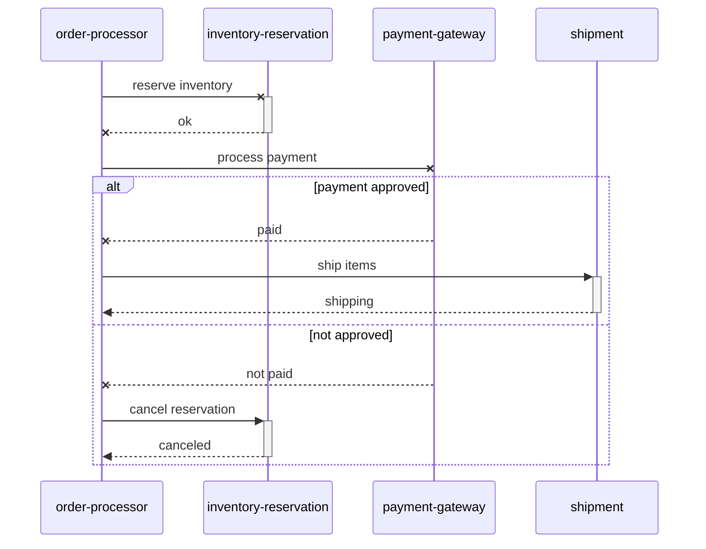

```mermaid
sequenceDiagram
    participant O as order-processor
    participant I as inventory-reservation
    participant P as payment-gateway
    participant S as shipment
    O -x+ I:reserve inventory
    I --x- O: ok
    O -x P: process payment
    alt payment approved
        P --x O: paid        
        O ->>+ S: ship items
        S -->>- O: shipping
    else not approved
        P --x O: not paid
        O ->>+ I:cancel reservation
        I -->>- O: canceled
    end
```